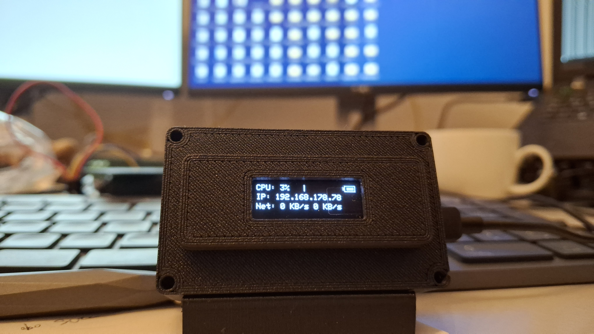

# CPU_LCD_ESP32



To run a `.sh` script as a service on Ubuntu, you can create a `systemd` service file. Here is a step-by-step guide to accomplish this:

### Step 1: Prepare Your Script

Ensure your script is executable and has the correct shebang (e.g., `#!/bin/bash` at the top).

```bash
chmod +x /path/to/your-script.sh
```

### Step 2: Create a Systemd Service File

Create a service file for your script in the `/etc/systemd/system/` directory. You will need administrative privileges to write here.

Use an editor like `nano` to create and edit the file:

```bash
sudo nano /etc/systemd/system/your-script.service
```

### Step 3: Define the Service

In the service file, define the service like this:

```ini
[Unit]
Description=Your Script Service
After=network.target

[Service]
ExecStart=/path/to/your-script.sh
# Optionally, specify a user and group
# User=your-username
# Group=your-groupname
# Specify the environment if needed
# Environment="VAR_NAME=value"

[Install]
WantedBy=multi-user.target
```

- Modify `/path/to/your-script.sh` to point to the actual path of your script.
- Uncomment and change `User` and `Group` if the script should run as a specific user.
- You might need to set the `Environment` variables depending on what your script requires.

### Step 4: Reload Systemd, Start, and Enable the Service

Reload `systemd` to recognize the new service:

```bash
sudo systemctl daemon-reload
```

Start the service with:

```bash
sudo systemctl start your-script.service
```

Enable the service to start at boot with:

```bash
sudo systemctl enable your-script.service
```

### Step 5: Verify the Service

Check the status of the service to ensure it is running correctly:

```bash
sudo systemctl status your-script.service
```

If you encounter any errors, this command will provide logs and details to help you diagnose.

### Step 6: Manage the Service

You can stop, restart, and check the status of your service using the following commands:

- Stop the service:

  ```bash
  sudo systemctl stop your-script.service
  ```

- Restart the service:

  ```bash
  sudo systemctl restart your-script.service
  ```

- Check the status:

  ```bash
  sudo systemctl status your-script.service
  ```

By using `systemd`, your script can run efficiently as a service with proper startup and shutdown procedures. Make sure you thoroughly test your script to ensure it handles restarts and failures gracefully.

To get the logs for your service managed by `systemd`, you can use the `journalctl` command. This command provides access to logs from all services and the system in general. Here's how you can specifically view the logs for your custom service:

### View Logs for a Specific Service

The basic command to view logs for a specific service is:

```bash
journalctl -u your-script.service
```

Replace `your-script.service` with the actual name of your service file.

### Real-Time Logs

To view logs in real-time (similar to `tail -f`), you can use the `-f` option:

```bash
journalctl -u your-script.service -f
```

This is useful for monitoring the service as it runs.

### Filtering by Time

You can also filter logs by time to narrow down to specific events. For example:

- **Logs from today:**

  ```bash
  journalctl -u your-script.service --since today
  ```

- **Logs from a specific date and time:**

  ```bash
  journalctl -u your-script.service --since "2023-10-20 12:00:00" --until "2023-10-20 14:00:00"
  ```

### Limiting Output

If you want to limit the output to a certain number of recent lines, you can use the `-n` option:

```bash
journalctl -u your-script.service -n 50
```

This will show the last 50 lines of logs for the service.

### Verbosity

To increase the verbosity and get more detailed logs, you can use the `-x` option to include explanations for log messages:

```bash
journalctl -xe -u your-script.service
```

### Access Permissions

Keep in mind that accessing system logs might require administrative privileges, so you might need to prefix the command with `sudo`:

```bash
sudo journalctl -u your-script.service
```

By using `journalctl`, you can effectively monitor and debug your service by examining logs and understanding the sequence of events leading to potential issues.

---

## Arduino Code

Sure, let's break down the provided code and add comments to explain its functionality:

```cpp
#include <Wire.h>
#include <Adafruit_GFX.h>
#include <Adafruit_SSD1306.h>
#include "BluetoothSerial.h"

// Initialize Bluetooth Serial for communication
BluetoothSerial SerialBT;

// Define display dimensions
#define SCREEN_WIDTH 128   // OLED display width, in pixels
#define SCREEN_HEIGHT 32   // OLED display height, in pixels

const int LED = 13; // Pin for the onboard LED
Adafruit_SSD1306 display(SCREEN_WIDTH, SCREEN_HEIGHT, &Wire, -1);

// Variable to track toggle state for visual indicator
static bool toggleState = false;

void setup() {
  // Set the LED pin as an output
  pinMode(LED, OUTPUT);

  // Start serial communication for debugging purposes
  Serial.begin(115200);

  // Initialize the OLED display with I2C address 0x3C
  if (!display.begin(SSD1306_SWITCHCAPVCC, 0x3C)) {
    Serial.println("SSD1306 allocation failed");
    for (;;); // Enter infinite loop if display initialization fails
  }

  // Set display orientation
  display.setRotation(0);

  // Clear the display buffer
  display.clearDisplay();

  // Set text size and color for display
  display.setTextSize(1);
  display.setTextColor(SSD1306_WHITE);

  // Initialize Bluetooth Serial with name "ESP32_BT2"
  SerialBT.begin("ESP32_BT2");
  Serial.println("The device started, now you can pair it with Bluetooth!");
}

void loop() {
  handleBluetoothData(); // Handle incoming Bluetooth data
  handleSerialData();    // Handle incoming Serial data
}

void handleBluetoothData() {
  // Check if data is available on Bluetooth
  if (SerialBT.available()) {
    String data = SerialBT.readStringUntil('\n'); // Read data until newline
    displayData(data);                            // Display the received data
    Serial.println(data);                         // Print data to Serial monitor
  }
}

void handleSerialData() {
  // Check if data is available on Serial
  if (Serial.available()) {
    String data = Serial.readStringUntil('\n'); // Read data until newline
    displayData(data);                          // Display the received data
  }
}

void displayData(String data) {
  digitalWrite(LED, HIGH); // Turn on LED to indicate data processing

  // Parse the data using " - " as the separator
  int firstSeparator = data.indexOf(" - ");
  int secondSeparator = data.indexOf(" - ", firstSeparator + 1);
  int thirdSeparator = data.indexOf(" - ", secondSeparator + 1);

  // Extract and convert CPU usage
  String cpuUsageStr = data.substring(0, firstSeparator);
  int cpuUsage = cpuUsageStr.toInt();

  // Extract IP address
  String ipAddress = data.substring(firstSeparator + 3, secondSeparator);

  // Extract network usage
  String networkUsage = data.substring(secondSeparator + 3, thirdSeparator);

  // Extract and convert battery level
  String batteryLevelStr = data.substring(thirdSeparator + 3);
  int batteryLevel = batteryLevelStr.toInt();

  // Clear the display buffer
  display.clearDisplay();

  // Display CPU usage and draw a visual bar
  display.setCursor(0, 0);
  display.print("CPU: ");
  display.print(cpuUsage);
  display.print("% ");

  int textWidth = 60; // Space allocated for CPU usage text
  int barStartX = textWidth;
  int barWidth = map(cpuUsage, 0, 100, 0, SCREEN_WIDTH - textWidth - 22);
  display.fillRect(barStartX, 0, barWidth, 8, SSD1306_WHITE);

  // Draw battery symbol with visual indication of battery level
  int batteryBarWidth = map(batteryLevel, 0, 100, 0, 10);
  display.fillRect(SCREEN_WIDTH - 19 + 1, 2, 2, 4, SSD1306_WHITE);
  display.drawRect(SCREEN_WIDTH - 16, 0, 14, 8, SSD1306_WHITE);
  display.fillRect(SCREEN_WIDTH - batteryBarWidth - 4, 2, batteryBarWidth, 4, SSD1306_WHITE);

  // Display IP address
  display.setCursor(0, 12);
  display.print("IP: ");
  display.println(ipAddress);

  // Display network usage
  display.setCursor(0, 24);
  display.print("Net: ");
  display.println(networkUsage);

  // Toggle a visual indicator between a dot and a space
  display.setCursor(SCREEN_WIDTH - 7, 24);
  if (toggleState) {
    display.print("."); // Print a dot
  } else {
    display.print(" "); // Print a space
  }
  toggleState = !toggleState; // Toggle state for next cycle

  display.display(); // Send display buffer to the screen
  digitalWrite(LED, LOW); // Turn off LED after processing
}
```

### Explanation:

- **Initialization**: The setup function initializes the display and Bluetooth serial communication, ensuring the device is ready for data processing.
- **Data Handling**: The device handles incoming data from two sources: Bluetooth (`SerialBT`) and traditional serial (`Serial`). Both sources use similar methods to read and process data.
- **Data Processing**:
  - Data from both interfaces is read line-by-line until a newline character.
  - The string is parsed using `" - "` as the delimiter to separate CPU usage, IP address, network usage, and battery level data.
  - Each data segment is handled accordingly, with CPU usage and battery level additionally being visualized through progress bars on the display.
- **Display Functionality**: The `displayData` function clears the screen, renders the data, and toggles a simple on-screen indicator for visual confirmation that the display is being updated.
- **Visual Output**: Information such as CPU usage and network usage is rendered to the OLED display, thus providing real-time feedback from the incoming data. The functionality also includes a visual indicator to show the current state in successive loops.
